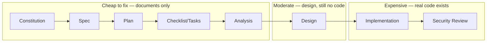
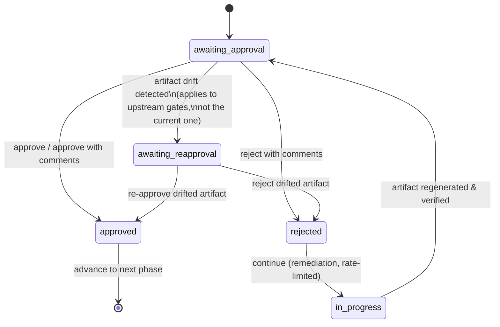

# SDLE — Spec Driven Lifecycle Engine
## Enterprise Reference Guide

| Field | Value |
|---|---|
| **Document title** | SDLE Design, Architecture & Phase Reference |
| **Covers software version** | SDLE v1.14 (18-phase workflow, 8 approval gates, deterministic core, WorkItem-scoped runtime) |
| **Document version** | 1.1 |
| **Audience** | Engineering leadership, delivery managers, platform/DevEx teams, security & compliance reviewers, individual contributors operating SDLE |
| **Classification** | Internal — Engineering Reference |
| **Status** | Active |
| **Last updated** | 2026-07-06 |

---

## Table of Contents

1. [Executive Summary](#1-executive-summary)
2. [Purpose & Intention](#2-purpose--intention)
3. [Design Philosophy & Core Principles](#3-design-philosophy--core-principles)
4. [System Architecture](#4-system-architecture)
5. [Glossary of Key Terms](#5-glossary-of-key-terms)
6. [Commonly Misunderstood Terms](#6-commonly-misunderstood-terms)
7. [The 18-Phase Workflow — Detailed Reference](#7-the-18-phase-workflow--detailed-reference)
8. [Flow Diagrams](#8-flow-diagrams)
9. [Approval Gate Mechanics](#9-approval-gate-mechanics)
10. [Rejection, Remediation & Rate Limiting](#10-rejection-remediation--rate-limiting)
11. [Artifact Drift Detection & Re-Approval](#11-artifact-drift-detection--re-approval)
12. [State, Audit Trail & Traceability](#12-state-audit-trail--traceability)
13. [Roles & Responsibilities](#13-roles--responsibilities)
14. [Compliance & Governance Alignment](#14-compliance--governance-alignment)
15. [Risks, Limitations & Non-Goals](#15-risks-limitations--non-goals)
16. [Common Misconceptions — Clarified](#16-common-misconceptions--clarified)
17. [When to Use SDLE (and When Not To)](#17-when-to-use-sdle-and-when-not-to)
18. [Appendix A — Example End-to-End Run](#appendix-a--example-end-to-end-run)
19. [Appendix B — State Schema Reference](#appendix-b--state-schema-reference)
20. [Appendix C — Command Reference](#appendix-c--command-reference)
21. [Document Revision History](#document-revision-history)

---

## 1. Executive Summary

SDLE (**Spec Driven Lifecycle Engine**) is a governed orchestration layer that runs on top of SpecKit inside Claude Code. It turns an AI coding assistant from a tool that *responds to prompts* into a system that *executes a fixed, auditable software delivery lifecycle*: requirements → constitution → specification → plan → checklist/tasks → analysis → design → implementation → security review, with eight mandatory human approval gates along the way.

The problem SDLE solves is not "can an LLM write code" — it is **"can an organization trust, govern, and audit a workflow in which an LLM writes code."** Left unconstrained, an AI assistant will happily skip straight from a one-line prompt to a finished pull request, silently inventing scope, architecture, and security posture as it goes, with no record of what was decided, why, or who agreed to it. SDLE replaces that ad hoc path with a fixed sequence of small, reviewable, written artifacts, each one gated by an explicit human decision before the next is generated.

Every phase exists to make a specific class of error cheap to catch. Every gate exists because at least one prior project — somewhere — shipped a defect that a five-minute review at that exact point would have caught. The phases are not ceremony; they are a deliberately ordered set of checkpoints, each placed where the cost of being wrong is lowest and the cost of skipping it is highest.

This document is the canonical reference for *why* SDLE is built the way it is. It is intended to be read once in full by anyone introducing SDLE into a team's workflow, and consulted thereafter as a lookup reference for individual phases, terms, and behaviors.

---

## 2. Purpose & Intention

### 2.1 The problem SDLE addresses

Generative AI coding tools collapse the distance between an idea and running code to almost nothing. This is the source of their value — and the source of their risk. Without structure, AI-assisted development tends to reproduce the worst-case failure modes of decades-old waterfall *and* decades-old cowboy coding simultaneously:

- **Scope is implicit.** The model infers what to build from a short prompt, and that inference is never written down or agreed to.
- **Architecture is incidental.** Technical decisions are made inline, one file at a time, with no documented rationale and no point at which a human evaluates the approach as a whole before code exists.
- **Review happens too late, or not at all.** By the time a human looks at the output, it is a finished diff — reviewing it means re-deriving requirements, design, and intent from the code itself.
- **There is no audit trail.** When something goes wrong in production, there is no record of what was approved, by whom, when, against what artifact, or what feedback was given during revision.
- **Security is an afterthought.** "Add a security review" typically means asking the same model that wrote the code to also grade its own homework, with no evidence trail and no acknowledgement of what the review does *not* cover.

### 2.2 The intention behind SDLE

SDLE's intention is to make the *process* — not just the *output* — of AI-assisted software delivery something an enterprise can stand behind. Concretely, it aims to:

1. **Force explicit, written intermediate artifacts** (constitution, spec, plan, tasks, design, manifest, security review) at every stage where a decision is made, so that decisions are inspectable instead of implicit.
2. **Require a human decision at every high-leverage juncture**, with no path for the AI to advance the workflow on its own authority.
3. **Make every decision traceable**: who decided, what they decided, when, against which exact version (SHA-256 fingerprint) of which artifact.
4. **Catch errors as early and as cheaply as possible** — a wrong assumption in a constitution costs a paragraph edit; the same assumption discovered after implementation costs a rewrite.
5. **Be honest about what it does and does not guarantee** — most visibly in the security review phase, which is explicitly labeled AI-assisted and explicitly lists what it does not cover.
6. **Survive interruption** — sessions end, context windows fill, machines restart. SDLE re-derives the full truth of where it is from a single state file on every turn, rather than depending on conversation memory.

SDLE does not make the underlying model smarter. It makes the *process around* the model accountable.

---

## 3. Design Philosophy & Core Principles

These principles are not abstractions — each maps directly to a specific mechanism implemented in the orchestrator.

| Principle | What it means | How it is implemented |
|---|---|---|
| **State-first execution** | The orchestrator's memory of "where we are" is never trusted from conversation context alone. | `workitems/<id>/.sdle/state.json` is read from disk and a status header is emitted at the start of **every** turn, before any other action. |
| **Gate discipline** | No phase may be considered complete, and no phase may begin, without an explicit human decision where one is required. | The dispatcher recognizes only literal `approve` / `reject with comments:` commands; there is no implicit-advance path. |
| **No silent forward progress** | The AI never decides on the user's behalf that "this looks fine, moving on." | Status is frozen (`awaiting_approval`, `in_progress`, `failed`) until a human acts. |
| **Fail-safe, not fail-open** | When something is ambiguous, broken, or unverifiable, the system halts and asks — it does not guess and continue. | Tool failures, missing artifacts, and unreadable state all freeze status rather than advancing it. |
| **Abstraction boundary (SpecKit opacity)** | The underlying generation engine (SpecKit) is an implementation detail, not a user-facing concept. | Internal skill names and slash-command syntax are never surfaced to the user. |
| **Idempotency under interruption** | Re-running after a crash should not duplicate work or corrupt state. | `phase_checkpoint` records a sub-step marker before any generation call; on resume, SDLE checks whether the expected artifact already exists before re-invoking generation. |
| **Tamper-evidence, not just trust** | An approval is bound to the *exact bytes* of the artifact at approval time, not to "whatever is in that file now." | SHA-256 fingerprints are recorded at approval (`artifact_shas`) and re-computed before every phase to detect drift. |
| **Cost-of-change minimization** | Defects should be caught at the cheapest point to fix them. | Phase ordering deliberately front-loads cheap-to-edit documents (constitution → spec → plan) before expensive-to-edit code (implement), with design documents inserted *before* implementation specifically to keep architecture changes cheap. |
| **Bounded automation** | Automated retry/remediation loops must terminate, not run indefinitely against the same root cause. | `rate_limits.max_remediation_attempts` and `rate_limits.max_retry_attempts` cap automatic re-invocation per phase. |
| **Complete, attributable audit trail** | Every meaningful event is written to an append-only ledger with actor, action, artifact, and outcome. | `workitems/<id>/.sdle/audit.md` — one entry per gate decision, phase completion, rejection, drift event, and rate-limit trip. |

---

## 4. System Architecture

### 4.1 Components

```
SDLE Orchestrator (Claude Code Skill)
│
├── SKILL.md                         Always-loaded entry point
│     • Core rules, 18-phase table, internal constants (single source of truth)
│     • State inspection, command dispatcher, state-file schema & migrations
│
├── modules/phase-execution.md       Loaded when executing any non-gate phase
│     • Per-phase generation logic, guidance injection, drift check,
│       idempotency recovery, post-generation verification
│
├── modules/gate-protocol.md         Loaded at any gate phase or on approve/reject
│     • Gate prompt rendering, approval recording, rejection & remediation flow
│
├── modules/security-review.md       Loaded only at Phase 17 (security_review)
│     • Evidence-gathering procedure and review template
│
└── SpecKit (external, wrapped)
      • speckit-constitution / -specify / -plan / -checklist / -tasks
      • speckit-analyze / -implement / -clarify
      • Invoked via the Skill tool; never exposed to the user by name
```

### 4.2 Runtime artifacts (in the target project)

| Path | Produced by | Purpose |
|---|---|---|
| `requirements/` | User | Ground-truth input; the only thing SDLE never generates |
| `.specify/memory/constitution.md` | Phase 2 | Project ground rules and constraints |
| `.specify/specs/<feature-id>/spec.md` | Phase 4 | Functional specification |
| `.specify/specs/<feature-id>/plan.md` | Phase 6 | Technical implementation plan |
| `.specify/specs/<feature-id>/checklist.md` | Phase 8 | Independent completeness checklist |
| `.specify/specs/<feature-id>/tasks.md` | Phase 9 (refined Phase 11) | Granular task breakdown |
| `design/app/app-design.md` | Phase 13 | Architecture & sequence diagrams, design decisions |
| `design/db/db-design.md` | Phase 13 (conditional) | ERD, data dictionary, data design decisions |
| `workitems/<id>/.sdle/implementation-manifest.md` | Phase 15 | Reviewable summary of all files changed by implementation, including a mandatory secrets-scan section |
| `reviews/security-review-<timestamp>.md` | Phase 17 | Evidence-based security review |
| `workitems/<id>/.sdle/state.json` | Orchestrator | Canonical workflow state (the single source of truth) |
| `workitems/<id>/.sdle/audit.md` | Orchestrator | Append-only event ledger, hash-chained via `state.json → audit_sha` |
| `workitems/<id>/.sdle/lock` | Orchestrator | Session lock (timestamp + session token) for concurrent-session detection |
| `workitems/<id>/.sdle/completion-summary.json` | Gate 8 approval | Final, signed closure record |
| `workitems/<id>/.sdle/execution.json` | `init`, `migrate-workflow` | Execution identity (`<3-letter-git-prefix>-<UTC>`) and start instant |
| `workitems/<id>/.sdle/evidence/migration-*.json` | `migrate-workflow` | Legacy state/audit SHAs and Git HEAD captured at migration |
| `workitems/index.md`, `workitems/<id>/workitem.json` | `workitem create` | Append-only registry and immutable WorkItem identity |
| `clarifications/*.clarify` | User (via clarify loop) | Persisted answers to the spec-phase SpecKit `clarify` questions, or free-text context from the Phase 11 analyze prompt |
| `guidance/*.md` | User (optional) | Per-phase steering content, read if present |

### WorkItem identity

A **WorkItem** is the durable name for a piece of work. It is created *before*
the workflow is initialised, and it never changes afterwards. Since v1.14 it is
also the **runtime scope**: all workflow state lives under
`workitems/<id>/.sdle/`, `state.json` records which WorkItem it belongs to, and
independent WorkItems share no state, no audit ledger and no lock. Every phase
and gate behaves exactly as it did before WorkItems existed.

Two id shapes are accepted:

| How it was created | Shape | Example |
|---|---|---|
| From a user-supplied name (default) | normalised kebab-case | `customer-notification-service` |
| `--auto-generate` | `WI-<name>-<YYYYMMDDTHHMMSSZ>` | `WI-payment-retry-20260816T170530Z` |

Normalisation is deterministic: trim, lowercase, whitespace and `_` become `-`,
unsupported punctuation is dropped, repeated hyphens collapse, leading and
trailing hyphens are stripped, and only `[a-z0-9-]` survives. An empty result
is refused, as is a name that carries a path separator or a pipe, one that
normalises to more than 64 characters, and one that lands on a Windows
reserved device name. Uniqueness is enforced case-insensitively against both
the registry and the directory listing; a duplicate is refused rather than
suffixed, and the caller is asked to resume the existing WorkItem or supply
another name.

Each WorkItem gets `workitems/<id>/workitem.json` — id, name, human title,
type, synopsis, creation instant, the Git identity and branch captured at
creation, and the SDLE version. Missing Git is recorded as `null`, never
refused. Every creation also appends one row to `workitems/index.md`, an
append-only registry with no mutable status column. The registry's structure is
validated before each append; if it is damaged, `workitem create` and
`workitem list` both fail as an integrity error and change nothing, because a
corrupt ledger is repaired deliberately, not silently rewritten.

Both files are intended to be committed. They are the durable creation record,
which is why WorkItem creation does not append to `workitems/<id>/.sdle/audit.md` — the
audit ledger belongs to a workflow, and a WorkItem exists before one does.

### WorkItem resolution and the legacy runtime

Every command that touches runtime state resolves a WorkItem first, in this
order: an explicit `--workitem <id>`, which must be registered; otherwise the
sole registered WorkItem; otherwise a repository-global `.workflow/state.json`,
if one exists and **no** WorkItem is registered. With none registered the
command refuses `workitem_required`; with several registered and none named it
refuses `workitem_ambiguous` and lists the candidates. SDLE never picks one.
`lint-skill`, `sha`, `constants`, `workitem` and `migrate-workflow` touch no
runtime state and need no resolution.

The third rung is transitional. It exists so a repository holding a pre-v1.14
workflow stays readable long enough to be migrated, and it disappears once any
WorkItem is registered. `init` never takes it: while a repository-global
`.workflow/state.json` exists, `init` refuses `legacy_workflow_present`
regardless of how many WorkItems are registered, because creating a second
runtime beside it would leave the legacy workflow simultaneously unbindable
and unmigratable.

`migrate-workflow --workitem <id>` moves it, in an order chosen so that an
interruption is always recoverable. It requires an already-registered
WorkItem; refuses `target_exists` if that WorkItem already has a runtime;
validates the legacy `state.json`; verifies the legacy audit chain and
`audit_sha`, refusing `legacy_audit_broken` rather than carrying a break into
the WorkItem; captures the legacy SHAs and the current Git HEAD as evidence;
copies the ledger, manifest, completion summary, `evidence/migration-*.json`
and `execution.json`; re-verifies the copied ledger at its new location;
migrates the state in memory; appends a `workflow_migrated` entry to the
**target** ledger; and only then writes the target `state.json` — the sole
commit marker. A final re-read verifies phase, status, progress, approvals,
artifact SHAs, rate limits, attempt counts, `implementation_base_ref` and
`phase_history`, and rolls the commit marker back on mismatch. The migration is
recorded on `workitem.json`. `.workflow/` is never written to, renamed or
deleted, so recovery is simply deleting `workitems/<id>/.sdle/`.

### Execution identity

Each `init` and each migration stamps `workitems/<id>/.sdle/execution.json`
with an execution id of the form `<3-letter-git-user-prefix>-<UTC datetime>`,
for example `muh-20260816T171501Z`. The prefix is `git config user.name`,
lowercased with non-alphanumeric characters removed, truncated to three
characters, falling back to the email local part and finally to `usr`. It is
execution and audit metadata: nothing resolves a WorkItem from it, and it is
never the WorkItem name.

### 4.3 Why a state file, not conversation memory

Conversation context is volatile: it can be summarized, truncated, or lost entirely between sessions. SDLE treats `workitems/<id>/.sdle/state.json` as the only authoritative record of workflow position. Every turn re-reads it, re-validates it against `phase_history` (the **Recovery Consistency Check**), and re-derives the status header from it. This means a workflow can be paused for days, resumed in a brand-new conversation, or recovered after a crash mid-phase, and SDLE will behave identically to a continuous session.

---

## 5. Glossary of Key Terms

| Term | Definition |
|---|---|
| **SDLE** | Spec Driven Lifecycle Engine — the orchestrator described in this document. |
| **SpecKit** | The underlying open-source generation toolkit SDLE wraps. Provides the `speckit-*` skills that actually generate constitution/spec/plan/tasks/analysis/implementation content. |
| **Orchestrator** | SDLE itself, in its role as the entity that sequences phases, enforces gates, and maintains state. Distinct from SpecKit, which only generates content when invoked. |
| **Phase** | One of the 18 discrete steps in the workflow (e.g., `spec_draft`, `gate_spec`). Either an *execution phase* (generates or validates something) or a *gate phase* (awaits human approval). |
| **Gate** | An execution-blocking checkpoint requiring an explicit human `approve` or `reject with comments:` decision. There are 8 gates, numbered 1–8. |
| **Artifact** | Any file generated by a phase that becomes the subject of a gate (constitution.md, spec.md, plan.md, tasks.md, app-design.md, implementation-manifest.md, the security review file). |
| **Constitution** | The Phase 2 artifact establishing the project's foundational principles, constraints, and technical guardrails. Not a legal document — an engineering one. |
| **Specification (Spec)** | The Phase 4 artifact defining *what* is to be built: user stories, scope, acceptance criteria. |
| **Plan** | The Phase 6 artifact defining *how* the spec will be technically realized: architecture, stack, integration approach. |
| **Checklist** | The Phase 8 artifact: an independent completeness check cross-referenced against the plan, displayed alongside tasks at Gate 4 but not itself gated. |
| **Tasks** | The Phase 9 artifact: the granular, ordered work breakdown derived from the plan. Refined again during `analyze` (Phase 11). |
| **Analyze** | Phase 11: an automated cross-consistency pass across constitution, spec, plan, and tasks, run by SpecKit before any code is written. |
| **Design Generation** | Phase 13: an SDLE-native (non-SpecKit) phase producing application and (conditionally) database design documents *before* implementation. |
| **Implementation Manifest** | The Phase 15 artifact: a git-derived list of every file changed during implementation, used as the reviewable surface at Gate 7 instead of asking the reviewer to inspect the whole repository. |
| **Security Review** | The Phase 17 artifact: an evidence-based, git-diff-driven, OWASP-mapped review with an explicit disclaimer and a list of recommended tools. AI-assisted, not a substitute for SAST/DAST or a professional audit. |
| **Completion Summary** | `workitems/<id>/.sdle/completion-summary.json`, written only when Gate 8 is approved. The formal closure record of the workflow. |
| **Artifact Fingerprint (SHA-256)** | A cryptographic hash of an artifact's exact bytes, recorded at the moment of approval. The basis for drift detection. |
| **Drift** | A change to an artifact's on-disk content *after* it was approved, detected by comparing its current SHA-256 against the approval-time SHA-256. Not related to git "drift" or merge conflicts. |
| **Drift Queue** | The ordered list of gate keys awaiting re-approval because their artifacts drifted. Blocks normal phase execution until cleared. |
| **Remediation** | The act of regenerating an artifact after a `reject with comments:` decision, incorporating the recorded feedback. Counted separately from retries. |
| **Retry** | Re-attempting a generation step after a *technical failure* (e.g., the artifact wasn't produced or was too small) — not the same as remediation, which follows a human rejection. |
| **Rate Limit** | A configurable per-phase cap on remediation attempts and retry attempts, preventing infinite loops against an unresolved root cause. |
| **Phase Checkpoint** | A sub-step marker (`phase_checkpoint`) saved before any generation call, enabling crash-recovery without duplicate work. |
| **Guidance File** | An optional, user-authored file in `guidance/` that, if present, is injected into the relevant phase's generation call to steer its output. Absence changes nothing. |
| **Clarification** | A user response to a spec-phase SpecKit `clarify` question, or to the Phase 11 analyze prompt, persisted to `clarifications/` so it survives outside conversation memory. |
| **Audit Trail (`audit.md`)** | The append-only, timestamped, attributed ledger of every meaningful workflow event. |
| **Forward Jump** | An attempt for `current_phase` to be more than 2 phases ahead of the last confirmed history entry — flagged by the Recovery Consistency Check as a possible state inconsistency requiring explicit acknowledgement. |
| **Restart Phase N** | A user command that rolls the workflow *backward* to phase N, clearing all approvals and history from that point forward. The only sanctioned way to undo progress. |
| **Skip With Warning** | An explicit, logged override that advances past a *failed* (not rejected) phase without a verified artifact. Always discouraged, always audited. |
| **Verbose Mode** | A display-only toggle controlling how much internal operational detail (module reads, hash computation, raw SpecKit invocation) is shown. Never changes underlying behavior. |

---

## 6. Commonly Misunderstood Terms

| Term | Common (incorrect) reading | Correct reading |
|---|---|---|
| **"Approval"** | "I reviewed the code." | For Gates 1–6, there is no code yet — you are approving a *document* (constitution, spec, plan, tasks, analysis, design). Only Gate 7 (`gate_implement`) involves reviewing actual code. |
| **"Security Review"** | A professional security audit / penetration test. | An AI-assisted, evidence-based review limited to artifacts and a git diff. It explicitly lists what it does *not* cover and recommends specific tools (SAST, dependency scanners, secret scanners) that must be run separately. |
| **"Constitution"** | A legal, compliance, or HR-style governance document. | An engineering artifact: project principles, technical constraints, and guardrails that bind every later phase's output. |
| **"Gate"** | An optional checkpoint that can be waved through. | A hard block. There is no command that advances past a gate without an `approve`. |
| **"Drift"** | Source control drift, merge conflicts, or branch divergence. | A previously-approved artifact's on-disk content changing after approval (e.g., someone hand-edited `spec.md`). Detected by SHA-256 comparison, unrelated to git. |
| **"Restart phase N"** | "Try this phase again." | A destructive rollback: it clears all approvals, SHA baselines, and history for phase N and everything after it. The correct command for "try this phase again without losing later approvals" does not exist by design — sequencing is intentionally one-directional except for explicit rollback. |
| **"Retry"** | Same thing as rejecting and asking for a redo. | A *retry* follows a technical failure (no artifact produced). A *remediation* follows a human rejection with feedback. They use separate rate-limit counters and separate recovery paths. |
| **"SpecKit opacity"** | The user is simply not told the implementation detail, but could invoke SpecKit directly if they wanted. | By design, SpecKit skill names and slash commands are never exposed and are not meant to be invoked manually mid-workflow — doing so bypasses state tracking, fingerprinting, and the audit trail entirely. |
| **"Checklist"** (Phase 8) | A gate, like the others. | Not gated on its own. It is generated and then displayed *alongside* tasks at Gate 4 (`gate_tasks`) for combined review. |
| **`current_artifact`** | The most important artifact overall. | The most *recently generated* artifact — purely a pointer used for the next gate prompt, reset every phase. |

---

## 7. The 18-Phase Workflow — Detailed Reference

> Each entry below follows the same structure: **What it does** → **Why it matters** → **Engineering rationale** → **If this phase did not exist.** Gate phases additionally describe what is being approved and why that specific moment is high-leverage.

### Phase 1 — Requirements Check (`requirements_check`)

**What it does:** Validates that a `requirements/` directory exists and contains at least one document; runs the Untrusted Content Scan on each file (flagging instruction-like lines directed at the orchestrator, which require an explicit `accept content` acknowledgement); infers a project name from it.

**Why it matters:** This is the only phase whose input is guaranteed to be human-authored, unmediated by the AI. Every subsequent artifact ultimately traces back to this one.

**Rationale:** An AI assistant without a grounding artifact will infer scope from whatever is in the conversation — including nothing at all. Requiring a written requirements input, checked before any generation begins, anchors the entire downstream chain to something a human actually wrote and can be held accountable to.

**If this phase did not exist:** The constitution and specification would be generated from conversational context alone — context that is informal, easy to lose, and not intended as a durable record. Two different sessions asking "build me X" could produce wildly different, ungrounded specifications with no way to determine which (if either) reflects actual stakeholder intent.

---

### Phase 2 — Generate Constitution (`constitution_draft`)

**What it does:** Invokes SpecKit's constitution generator to produce `.specify/memory/constitution.md`: the project's foundational principles, constraints, and technical guardrails.

**Why it matters:** The constitution is the highest-leverage artifact in the entire workflow. Every later phase — specification, plan, tasks, design, implementation — is generated *with the constitution as binding context*. An error here does not stay local; it propagates into every artifact downstream.

**Rationale:** Without an explicit, written set of ground rules, every phase would improvise its own assumptions about technology choices, coding conventions, and constraints — independently, and not necessarily consistently. The constitution exists to make those assumptions explicit once, at the point where they are cheapest to state and cheapest to correct.

**If this phase did not exist:** The specification might assume one tech stack, the plan another, and the implementation a third — with no single document any reviewer could check decisions against. Inconsistency would only surface once code from different phases collided, at which point it manifests as a bug or an architectural conflict rather than a one-line edit to a markdown file.

---

### Phase 3 — Gate 1: Constitution Approval (`gate_constitution`)

**What is being approved:** The foundational rules that will silently constrain every subsequent artifact.

**Why this is the highest-leverage gate:** Because the constitution feeds every later phase, a flaw caught here costs a paragraph edit. The identical flaw, if it survives to be caught at, say, Gate 6 (design), costs re-deriving the specification, plan, tasks, and design that were built atop the wrong assumption.

**If this gate did not exist:** Foundational errors (wrong tech stack constraint, missing compliance requirement, incorrect scope boundary) would be baked into the project invisibly and discovered, if at all, only when their downstream consequences became visible — typically during or after implementation, where they are the most expensive class of defect to fix.

---

### Phase 4 — Generate Specification (`spec_draft`)

**What it does:** Invokes SpecKit's specification generator to produce a functional specification — user stories, scope boundaries, acceptance criteria — bound to the approved constitution.

**Why it matters:** This is the phase that converts "what we said we wanted" into "what we are precisely committing to build," in a form specific enough to later verify against. It also resolves and records `current_feature_id`, the identifier under which every subsequent SpecKit artifact for this feature is filed.

**Rationale:** Separating *what* (spec) from *how* (plan, the next phase) prevents technical considerations from quietly narrowing or distorting scope before scope has even been agreed. Acceptance criteria written here become the yardstick used implicitly throughout the rest of the workflow.

**If this phase did not exist:** Architectural and implementation work would begin directly against the constitution and ambient conversation — i.e., against requirements that were never themselves converted into testable, agreed-upon acceptance criteria. Scope would be negotiated implicitly and continuously throughout development rather than fixed once, early, in writing.

---

### Phase 5 — Gate 2: Specification Approval (`gate_spec`)

**What is being approved:** The precise scope and acceptance criteria that the technical plan is about to be built against.

**Why this is high-leverage:** Scope changes discovered *after* a technical plan exists require re-deriving that plan. Scope changes caught here cost a specification edit.

**If this gate did not exist:** A plan, task breakdown, and design could all be generated against scope that was never actually confirmed — discovering a scope problem at, say, Gate 6 would invalidate the plan, checklist, tasks, and analysis built on top of it.

---

### Phase 6 — Generate Plan (`plan_draft`)

**What it does:** Invokes SpecKit's plan generator to produce a technical implementation plan from the approved specification and constitution: architecture, technology choices, integration approach.

**Why it matters:** This is the first phase where genuine technical decisions are made and recorded. It is the layer between "what to build" (spec) and "what specific units of work to do" (tasks) — without it, task generation has no architectural basis to decompose against.

**Rationale:** Technical approach should be reviewed and agreed *as a whole* — module boundaries, technology choices, integration points — before it is broken into granular tasks that are individually too small to reveal a flawed overall approach.

**If this phase did not exist:** Tasks would be generated directly from the specification with no intervening architectural decision layer, meaning the technical approach would be implicit, undocumented, and effectively decided task-by-task rather than reviewed holistically.

---

### Phase 7 — Gate 3: Plan Approval (`gate_plan`)

**What is being approved:** The technical architecture and approach, before it is decomposed into a task list.

**Why this is high-leverage:** This is the last point at which redirecting the *technical* approach is a documentation change rather than a re-implementation. Once tasks (Phase 9) and design (Phase 13) exist atop a given plan, changing the plan invalidates both.

**If this gate did not exist:** A flawed architectural decision (wrong database choice, missing integration consideration, an approach that conflicts with a constitutional constraint) would only be discovered once it had already been decomposed into tasks and possibly implemented — at which point correcting it is a rewrite, not an edit.

---

### Phase 8 — Generate Checklist (`checklist_draft`)

**What it does:** Invokes SpecKit's checklist generator to produce an independent completeness check against the plan. Not gated on its own; flows straight into Phase 9.

**Why it matters:** Task decomposition (the next phase) is a *generative* process — it produces what the model believes is a complete breakdown. The checklist is an *independent verification* artifact, generated with a different prompt and purpose, designed to surface gaps (missing non-functional requirements, untested edge cases, compliance items) that a single generative pass over the same plan might not surface on its own.

**Rationale:** Relying on one generation pass to both produce a task list *and* implicitly self-certify its completeness creates a blind spot — the same reasoning that produced the gap is unlikely to be the reasoning that notices it. An independently generated, cross-referenced checklist provides a second lens.

**If this phase did not exist:** The task breakdown at Gate 4 would have no independent completeness check beside it — a systemic gap (e.g., no task addressing a security constraint from the constitution) would be far easier to miss, with no second artifact to expose the discrepancy.

---

### Phase 9 — Generate Tasks (`tasks_draft`)

**What it does:** Invokes SpecKit's task generator to decompose the approved plan into discrete, ordered, verifiable units of work.

**Why it matters:** `tasks.md` becomes the actual contract for what `implement` (Phase 15) will build. It is also the artifact `analyze` (Phase 11) refines and the baseline `gate_tasks` and `gate_analyze` both reference.

**Rationale:** Implementation needs an explicit, granular, ordered work breakdown rather than an instruction to "build the plan" — granularity is what makes work estimable, parallelizable, and individually verifiable.

**If this phase did not exist:** `speckit-implement` would have to infer its own task structure ad hoc at generation time, with no separately reviewable, granular breakdown for a human to check against the plan before any code is written.

---

### Phase 10 — Gate 4: Tasks Approval (`gate_tasks`)

**What is being approved:** The granular task breakdown — displayed together with the Phase 8 checklist for combined review.

**Why this is high-leverage:** This is the last checkpoint before automated cross-document analysis (Phase 11) and the last *documentation-only* checkpoint before the workflow turns toward code. Reviewing tasks and checklist side by side here is specifically designed to catch coverage gaps before they become missing functionality.

**If this gate did not exist:** An incomplete or incorrectly granular task list could proceed straight to automated analysis and then design/implementation — and a missing task is far more expensive to detect once code already exists for everything *except* what was missed.

---

### Phase 11 — Analyze (`analyze`)

**What it does:** Invokes SpecKit's analysis pass to cross-check constitution, specification, plan, and tasks for mutual consistency, refining `tasks.md` in the process. Also updates the drift baseline so the refined tasks file doesn't trigger a false drift alert at the next gate.

**Why it matters:** Humans reviewing four related documents sequentially, gate by gate, are reviewing each in relative isolation — by the time you approve `gate_tasks`, the constitution approved several gates earlier is not necessarily fresh in mind, let alone being actively cross-checked against the brand-new tasks list. `analyze` is an automated pass purpose-built to catch exactly that class of error: contradictions and gaps that span multiple documents simultaneously.

**Rationale:** This is the final all-artifact consistency checkpoint while everything is still markdown. Everything before this point is cheap to edit; everything after this point (design, code) is comparatively expensive. It is the highest-value place to catch a cross-document inconsistency, because it is also the last place where catching it is still cheap.

**If this phase did not exist:** Latent contradictions between, say, a constraint in the constitution and an assumption baked into the plan would only surface once implementation hit the contradiction directly — at the code level, where diagnosing "which document was wrong" is a debugging exercise rather than a document review.

---

### Phase 12 — Gate 5: Analysis Approval (`gate_analyze`)

**What is being approved:** The findings of the cross-document consistency pass and the resulting refined `tasks.md`.

**Why this is high-leverage:** This is the final gate before the workflow crosses from "documents" into "design and code." Every gate up to this point has been reviewing artifacts that cost minutes to regenerate; every artifact from this point forward (design, implementation) costs materially more effort to redo.

**If this gate did not exist:** Implementation would begin on artifacts that were cross-checked by an automated pass but never confirmed by a human — removing the last low-cost opportunity to halt the workflow before code-level effort is spent.

---

### Phase 13 — Generate Design (`design_generation`)

**What it does:** An SDLE-native phase (no SpecKit call) that generates `design/app/app-design.md` — context diagram, component diagram, detail-level design narrative, sequence diagrams, and a table of significant design decisions with alternatives and trade-offs — and, conditionally, `design/db/db-design.md` (ERD, data dictionary, design decisions) if the feature involves persistent storage.

**Why it matters:** This phase exists specifically to put architecture documentation *before* implementation rather than after — or never. In fast-moving AI-assisted development, architecture documentation is the artifact most commonly skipped entirely, because the code itself appears to make it redundant. It is not redundant: code shows *what was built*, not *why it was built that way*, what alternatives were considered, or what trade-offs were accepted.

**Rationale:** Design is still cheap to revise here — it is diagrams and prose, not code. Placing it immediately before implementation means the documents that inform code generation are reviewed and approved *before* the code exists, rather than being reverse-engineered from the code afterward (if they are ever written at all).

**If this phase did not exist:** Implementation would proceed directly from `tasks.md` with no diagrammatic record of system structure, no documented rationale for architectural choices, and no artifact for future engineers, auditors, or incident responders to consult without reading the entire codebase. This is precisely the gap most legacy systems suffer from — undocumented architecture decisions whose reasoning is lost to time.

---

### Phase 14 — Gate 6: Design Approval (`gate_design`)

**What is being approved:** The application (and, where applicable, database) design — the structural blueprint implementation is about to follow.

**Why this is high-leverage — the practical "point of no return":** This is the last gate before any code is generated. Architecture is still cheap to change here (edit a diagram, rewrite a paragraph); once `implement` (Phase 15) runs, changing architecture means discarding and regenerating actual code.

**If this gate did not exist:** Implementation could begin against a design that was generated but never reviewed — meaning a structural flaw would only be discovered post-implementation, where fixing it means reworking working code rather than revising a document.

---

### Phase 15 — Implement (`implement`)

**What it does:** First runs a **dirty-tree guard**: if the working tree has uncommitted changes (outside SDLE's own artifact directories), the phase halts and requires an explicit `confirm implement` — otherwise the user's own edits would be mixed into, or overwritten by, the generated implementation and misattributed in the manifest. It then invokes SpecKit's implementation generator against `tasks.md`, explicitly informed by the Phase 13 design documents. Afterward, SDLE captures `git status --short` and `git diff --name-only HEAD` (combined and deduplicated, so untracked new files are not missed), runs a **secrets scan** over the changed files (AWS keys, private key material, GitHub/API tokens, hardcoded credential assignments, bearer tokens — findings masked and audited), and writes `workitems/<id>/.sdle/implementation-manifest.md` — a complete, reviewable list of every changed or added file, a mandatory `Potential Secrets Detected` section, and a summary of what was implemented.

**Why it matters:** This is the only phase that produces the actual deliverable. The implementation manifest exists because asking a reviewer to manually inspect an entire repository for "what changed" does not scale and is error-prone — a single consolidated, generated list is the reviewable surface instead.

**Rationale:** Generating code is necessary but not sufficient; the *change itself* needs to be expressed in a form a human can review without independently re-deriving it from raw git output, and that form needs to be tied back into the same state/audit system as every other phase.

**If this phase did not exist:** There would be no implementation at all — but absent the manifest specifically, a reviewer would have no single, generated, audit-trail-linked source of truth for what files were touched, making it easy to overlook untracked new files or miscount the actual blast radius of the change.

---

### Phase 16 — Gate 7: Implementation Approval (`gate_implement`)

**What is being approved:** The actual generated code, as summarized in the implementation manifest — the first and only gate at which real code, rather than a planning document, is under review. Because the manifest is the gate artifact and is displayed in full, any secrets-scan findings from Phase 15 are necessarily in front of the reviewer at the moment of decision; approving the gate is the explicit acknowledgement of those findings.

**Why this is high-leverage:** This is the mandatory human-in-the-loop checkpoint before AI-generated code is treated as a candidate for security review and delivery. It catches functional and quality issues outside the scope of the dedicated security review that follows.

**If this gate did not exist:** AI-generated code would proceed directly to (an explicitly limited) security review and then to completion without a human ever having reviewed the actual implementation — the single riskiest gap an enterprise adoption of AI-assisted coding could have.

---

### Phase 17 — Security Review (`security_review`)

**What it does:** An SDLE-native phase that gathers evidence (constitution, spec, plan, tasks, and a real `git diff` of the implementation), maps the detected tech stack to OWASP Top 10 relevance, flags only patterns *actually observed* in the diff (never invented), recommends concrete tooling (`npm audit`, `bandit`, `semgrep`, `trufflehog`, etc.) tailored to the stack, and explicitly states what the review does not cover. Every review carries a mandatory disclaimer: AI-assisted, not a substitute for SAST/DAST tooling, dependency scanning, or a professional audit.

**Why it matters:** This phase exists to make security consideration a structural, evidence-tied part of the workflow rather than an unstated assumption or a vague "looks fine" sign-off. Equally important is what it refuses to do: it does not claim coverage it cannot provide, and it does not fabricate findings not actually present in the diff.

**Rationale:** A security review that is honest about its limits is more useful — and less dangerous — than one that implies completeness it does not have. By tying findings strictly to the actual diff and explicitly listing recommended follow-up tools, the review functions as a structured starting point for a real security process, not a replacement for one.

**If this phase did not exist:** The workflow would reach "complete" with zero structured security consideration of the generated code — no documented evidence that security was even considered, let alone addressed, and nothing for a compliance or audit process to point to.

---

### Phase 18 — Gate 8: Security Review Approval (`gate_security`)

**What is being approved:** The security review's findings and recommendations — the final gate of the workflow.

**Why this is high-leverage:** Approving this gate writes `workitems/<id>/.sdle/completion-summary.json` and formally marks the workflow `complete`. It is the definitive closure record: all 8 gate decisions, their timestamps, and their artifact fingerprints become part of a single auditable summary.

**If this gate did not exist:** There would be no unambiguous "done" signal and no formal record that security findings were ever reviewed or acknowledged by a human — a significant gap for any organization that needs to demonstrate governance over how AI-assisted changes reach completion.

---

### Terminal state — Complete (`complete`)

No further action occurs. The workflow has produced a full, gated, auditable trail from raw requirements to a reviewed, security-considered implementation, with eight independent human decisions recorded along the way.

---

## 8. Flow Diagrams

### 8.1 Phase & Gate Flow

```mermaid
flowchart TD
    A[1. Requirements Check] --> B[2. Generate Constitution]
    B --> G1{{Gate 1\nConstitution}}
    G1 -- approve --> C[4. Generate Specification]
    G1 -- reject --> B
    C --> G2{{Gate 2\nSpecification}}
    G2 -- approve --> D[6. Generate Plan]
    G2 -- reject --> C
    D --> G3{{Gate 3\nPlan}}
    G3 -- approve --> E[8. Generate Checklist]
    G3 -- reject --> D
    E --> F[9. Generate Tasks]
    F --> G4{{Gate 4\nTasks + Checklist}}
    G4 -- approve --> H[11. Analyze]
    G4 -- reject --> F
    H --> G5{{Gate 5\nAnalysis}}
    G5 -- approve --> I[13. Generate Design]
    G5 -- reject --> H
    I --> G6{{Gate 6\nDesign}}
    G6 -- approve --> J[15. Implement]
    G6 -- reject --> I
    J --> G7{{Gate 7\nImplementation}}
    G7 -- approve --> K[17. Security Review]
    G7 -- reject --> J
    K --> G8{{Gate 8\nSecurity Review}}
    G8 -- approve --> L[Complete]
    G8 -- reject --> K

    classDef gate fill:#fff3cd,stroke:#b8860b,stroke-width:2px;
    classDef phase fill:#eef4ff,stroke:#4169e1,stroke-width:1px;
    classDef done fill:#d4f7dc,stroke:#1d7a3a,stroke-width:2px;
    class G1,G2,G3,G4,G5,G6,G7,G8 gate;
    class A,B,C,D,E,F,H,I,J,K phase;
    class L done;
```



### 8.2 Cost-of-Change Curve (why phase order matters)



Each gate sits at the boundary of these zones. The workflow is ordered so that the cheapest-to-fix artifacts are reviewed first and most frequently (5 gates before any design exists, 1 gate before any code exists), and the most expensive-to-fix artifact (code) is reviewed exactly once, immediately, before it can compound into a second expensive artifact (a security finding in shipped code).

### 8.3 Gate Decision Sub-Flow



---

## 9. Approval Gate Mechanics

Every gate follows an identical, non-negotiable sequence — consistency here is itself a control: a reviewer who has seen one gate knows exactly what every other gate will look like.

1. **Full artifact disclosure.** The complete content of the artifact under review is read from disk and displayed in the conversation (head + tail with a truncation marker for documents over ~3,000 words). The reviewer is never required to open a file manually to know what they are approving.
2. **Guidance alignment check.** If the user supplied an optional `guidance/<phase>.md` file, the gate explicitly reports which guidance items the artifact addressed and which it did not — surfacing gaps the reviewer might not otherwise notice.
3. **Explicit decision required.** Three responses are recognized: `approve`, `approve with comments: <text>`, `reject with comments: <text>`. A bare `reject` is rejected back to the user with a prompt to supply comments — feedback-free rejection is not a supported path, because remediation needs something concrete to act on.
4. **Fingerprint capture.** On approval, the artifact's current SHA-256 is computed and stored as the drift-detection baseline for that gate.
5. **Immutable record.** The decision, any comments, and a timestamp are written to `state.json → approvals[<gate>]` and appended to `audit.md`. This record is never edited retroactively — a later rejection or remediation creates new entries, it does not rewrite history.

---

## 10. Rejection, Remediation & Rate Limiting

Rejecting a gate is not "ask the AI to try again." It is a structured remediation cycle:

1. The reviewer's feedback is recorded as the canonical source of truth in `state.json`, then mirrored to `.specify/sdle-feedback.md` so the regeneration step can read it directly.
2. A per-phase **remediation counter** is checked against `rate_limits.max_remediation_attempts` (default 3). If the limit is reached, SDLE halts and will not re-invoke generation automatically — the reviewer must explicitly raise the limit, reset the counter, restart the phase from scratch, or accept the current state with `skip with warning` (itself a two-step command: it only executes after a typed `confirm skip`, consistent with restart and reset).
3. The relevant generator (SpecKit skill, or the SDLE-native design/security-review module) is re-invoked with the feedback explicitly embedded in its instructions, both via the feedback file and inline as a fallback.
4. Once the new artifact passes verification, the feedback file is archived (timestamped) rather than deleted outright, and the gate is re-presented with the new content.

A separate, independently tracked **retry counter** governs *technical* failures (an artifact that was never produced, or was produced but too small to be real) — these are not human-judgment rejections and are rate-limited separately so that a flaky generation step does not silently consume the remediation budget meant for substantive feedback.

This dual-counter design exists because the two failure modes have different root causes and different appropriate responses: a technical failure usually means "try again or escalate"; a rejection means "the substance was wrong, and feedback should change the next attempt." Conflating their limits would either let a feedback loop run unbounded (masked as "just retries") or starve a substantive rejection's remediation budget on transient technical failures.

---

## 11. Artifact Drift Detection & Re-Approval

Approved artifacts are ordinary files on disk. Nothing prevents a human from opening `spec.md` and hand-editing it after Gate 2 has already approved it. SDLE's answer to this is **drift detection**: before executing any phase, it recomputes the SHA-256 of every previously-approved artifact and compares it against the hash recorded at approval time.

- **If hashes match:** nothing happens — the approval is still valid.
- **If hashes differ:** the gate is no longer trustworthy. The affected gate(s) are queued (`drift_queue`), the current phase is paused (`pending_phase`), and the reviewer is shown exactly what changed (path, approved SHA, current SHA) and asked to **re-approve or reject** the drifted artifact before the workflow may proceed — sorted so the most upstream drifted gate is handled first, since its consequences cascade furthest.

**Why this matters:** Without it, an approval would mean "I approved whatever this file *was* at one point in time," which is a meaningless guarantee for an auditor. With it, an approval means "I approved exactly this content, and the system will tell me if that ever stops being true." This is the mechanism that makes the audit trail trustworthy even in the presence of manual file edits, merge operations, or any out-of-band modification.

---

## 12. State, Audit Trail & Traceability

### 12.1 `state.json` — the canonical state machine

`state.json` is not a cache or a convenience log — it is the single source of truth for workflow position. It is read first on every turn, migrated forward through schema versions automatically, and validated against `phase_history` for consistency (catching both accidental rollback and unexplained forward jumps). No other source — not conversation history, not the AI's own recollection — is treated as authoritative. On load, two further checks run: the **Audit Integrity Check** (below) and a **repository staleness check** that warns — without halting — when the repo has commits newer than the latest gate approval, i.e. when approvals may reflect a stale view of the codebase.

### 12.2 `audit.md` — the append-only ledger

Every gate decision, phase completion, rejection, remediation, drift event, and rate-limit trip is appended (never edited) to `audit.md` with: a UTC timestamp, the acting identity (resolved from git username/email), the action taken, the artifact involved, its SHA-256 fingerprint, the gate decision (if any), and any comments. This is the record an enterprise audit, post-incident review, or compliance check would consult.

Since v1.12 the ledger is **tamper-evident**: after every append, the SHA-256 of the entire file is recorded in `state.json → audit_sha`, and verified on every load. A mismatch (edit, truncation, deletion, or a write from another session) halts the workflow until the operator explicitly re-baselines with `accept audit` — an action that is itself logged. Note the precise guarantee: tamper-*evident*, not tamper-*proof* — an actor who edits both `audit.md` and `audit_sha` in `state.json` defeats the check. The defense target is accidental or casual modification, not a determined adversary with full filesystem access. Concurrent-session writes, one common source of accidental corruption, are additionally warned about via the `workitems/<id>/.sdle/lock` session lock.

### 12.3 `workitems/<id>/.sdle/completion-summary.json` — the closure record

Written exactly once, when Gate 8 is approved: workflow version, project name, completion timestamp, count of phases completed, the security review artifact path, and confirmation that all 8 gates were approved. This is the artifact that answers, unambiguously, "was this delivered through the governed process, and did it pass."

---

## 13. Roles & Responsibilities

| Role | Responsibility | Authority |
|---|---|---|
| **Reviewer / Approver** (the human operating SDLE) | Reads each gate's disclosed artifact content; decides `approve`, `approve with comments`, or `reject with comments`; provides substantive feedback on rejection. | Sole authority to advance or block the workflow at every gate. This authority cannot be delegated to or assumed by the orchestrator. |
| **SDLE Orchestrator** | Sequences phases; enforces gate discipline; maintains `state.json` and `audit.md`; performs drift detection, rate limiting, and recovery checks; renders every gate prompt with full artifact disclosure. | Generates and proposes; never self-approves. Halts on any ambiguity rather than guessing. |
| **SpecKit (generation engine)** | Performs the actual content generation for constitution, spec, plan, checklist, tasks, analysis, implementation, and clarification — when invoked by the orchestrator. | No autonomous role; invoked only by SDLE, never directly by the user during a workflow. |

A useful way to think about the separation: **SpecKit proposes, SDLE governs, the human decides.** No single actor in this chain can unilaterally advance the workflow.

---

## 14. Compliance & Governance Alignment

SDLE was not built against a named compliance framework, but its mechanisms map cleanly onto concepts common to enterprise change-management and audit requirements:

| Governance concept | SDLE mechanism |
|---|---|
| Segregation of generation from approval | Generation (SpecKit, SDLE-native phases) and approval (human gate decisions) are structurally distinct actions, never collapsed into one step. |
| Change traceability | Every artifact change is tied to a phase, a timestamp, an actor, and a SHA-256 fingerprint in `audit.md`. |
| Tamper detection | Drift detection on every previously-approved artifact, every phase. |
| Documented design rationale | Phase 13's "Important Design Decisions" table — alternatives considered and trade-offs accepted, not just the final choice. |
| Evidence-based security sign-off | Phase 17's diff-derived, OWASP-mapped findings with explicit scope limitations, rather than an unsupported "looks secure" assertion. |
| Formal closure record | `workitems/<id>/.sdle/completion-summary.json`, written only on final gate approval. |
| Bounded automated action | Rate-limited remediation/retry loops; no unbounded automated re-attempts against an unresolved root cause. |

SDLE's audit trail can support a compliance review; it does not, by itself, constitute certification against any specific regulatory framework (SOC 2, ISO 27001, etc.). Treat it as strong supporting evidence within a broader governance program, not as the program itself.

---

## 15. Risks, Limitations & Non-Goals

### 15.1 Known limitations

- **Gates are only as good as the reviewer.** SDLE enforces that a decision is made; it cannot enforce that the decision is well-considered. A reviewer who reflexively approves every gate without reading the disclosed content has all of the process overhead and none of the protective value.
- **The security review is explicitly bounded.** It does not perform dependency CVE scanning, runtime testing, infrastructure review, or business-logic security analysis. It exists to make security a structured checkpoint, not to replace dedicated security tooling or a professional audit.
- **Dependent on SpecKit.** SDLE orchestrates SpecKit; it does not generate constitution/spec/plan/tasks/implementation content itself. SpecKit's generation quality is a ceiling on SDLE's output quality.
- **Dependent on git for two specific artifacts.** The implementation manifest and the security review both rely on `git diff`/`git status` for accuracy. In a repository without git initialized, both degrade to approximate, explicitly-labeled fallbacks.
- **Rate limits can become a blocker, not just a safeguard.** If a root cause is never actually fixed, the remediation/retry limits will eventually halt the workflow rather than loop forever — this is intentional, but it does mean a misconfigured limit (set too low) can interrupt legitimate iterative work.
- **The audit log is tamper-evident, not tamper-proof.** The `audit_sha` hash chain detects edits, truncation, and out-of-band writes, but an actor who modifies both `audit.md` and `state.json` consistently defeats it. True non-repudiation would require signing with a secret SDLE does not hold.
- **Content scans are pattern-based.** The untrusted-content scan and the secrets scan are regex heuristics: they can false-positive on legitimate text (e.g. a requirements document that discusses "approval gates") and false-negative on obfuscated content. Both are deliberately warn-and-acknowledge, never silent-block, for exactly this reason.
- **The session lock is advisory.** Concurrent sessions are detected and warned about via `workitems/<id>/.sdle/lock`; nothing physically prevents two sessions from writing state simultaneously.

### 15.2 Non-goals (what SDLE is not)

- **Not a CI/CD pipeline.** SDLE governs the authoring lifecycle up to a reviewed implementation; it does not build, test, deploy, or release.
- **Not a project management tool.** It tracks phase and gate state for one feature workflow at a time, not backlogs, sprints, or cross-team planning.
- **Not a substitute for QA or penetration testing.** Functional testing and adversarial security testing remain separate, necessary activities after (or alongside) SDLE's gates.
- **Not a coding standards enforcement tool.** The constitution can *state* standards; SDLE does not lint or statically enforce them beyond what SpecKit's generation itself respects.
- **Not a multi-feature/multi-team orchestrator.** Each workflow instance tracks one feature at a time via `current_feature_id`.

---

## 16. Common Misconceptions — Clarified

1. **"SDLE produces secure, production-ready code automatically."**
   No. SDLE produces *reviewed* code — reviewed by a human at Gate 7, and accompanied by an explicitly-scoped, evidence-based security review at Gate 8. Neither step certifies the code as production-secure on its own; both are inputs to a human judgment call, and the security review explicitly names the tools (SAST, dependency scanning, secret scanning) that still need to be run.

2. **"Approving early gates means I reviewed the code."**
   No. For Gates 1 through 6, no code exists yet. You are reviewing documents — a constitution, a specification, a plan, a task list, an analysis, a design. Code first appears at Phase 15, and is first reviewed at Gate 7.

3. **"Rejecting a gate just tells the AI to try again."**
   No. Rejection records specific feedback as canonical state, writes it to a feedback file, and the next regeneration is explicitly instructed to incorporate that feedback. It is a targeted remediation cycle, not a blind retry, and it is rate-limited separately from technical retries.

4. **"I can skip a phase I don't think is necessary."**
   No supported path exists for skipping a phase outright. The closest mechanisms are `restart phase N` (a destructive rollback, not a skip) and `skip with warning` (only valid after a *technical failure*, always logged, and explicitly discouraged). Forward jumps are detected and blocked from silent acceptance.

5. **"Hand-editing an approved file is harmless if the content is still correct."**
   It is not silently accepted either way. Any change to a previously-approved artifact's bytes — correct or not — is detected as drift and forces a re-approval gate before the workflow can proceed. The system has no way to know the edit was "fine" without asking a human to confirm it.

6. **"Verbose mode changes what SDLE actually does."**
   It does not. Verbose mode is purely a display setting controlling how much internal operational detail (module reads, hash computation steps, raw SpecKit invocation strings) is shown. The underlying logic, gating, and verification behavior are identical either way.

7. **"The design phase (Phase 13) is a nice-to-have, cosmetic step."**
   It is a mandatory, gated phase that directly informs the implementation phase that follows it — the implementation invocation explicitly references the design documents. Skipping it (via `skip with warning`, if forced) removes architecture documentation from the workflow entirely, not just a diagram.

8. **"SDLE replaces SpecKit."**
   SDLE wraps and governs SpecKit; it does not replace its generation capability. SpecKit still performs every actual constitution/spec/plan/task/implementation generation — SDLE adds sequencing, gating, fingerprinting, and audit trail around those calls, and deliberately keeps SpecKit's own commands hidden from the user.

9. **"The conversation is the source of truth; state.json is just a backup."**
   It is the reverse. `state.json` is the canonical, authoritative record, re-read from disk at the start of every turn. Conversation history is not trusted as a state source — this is precisely what allows a workflow to be resumed correctly after a context loss, a new session, or a crash.

---

## 17. When to Use SDLE (and When Not To)

**Good fit:**
- Net-new features or services with a defined (even if informal) set of requirements.
- Work where an audit trail of decisions — who approved what, when, against which exact artifact — has organizational or compliance value.
- Teams adopting AI-assisted coding for the first time and wanting structured guardrails rather than open-ended prompting.
- Work where architecture and design documentation is valuable beyond the immediate change (long-lived systems, systems with future maintainers who are not the original authors).

**Poor fit / use a lighter-weight process instead:**
- Emergency hotfixes under time pressure, where eight sequential approval gates are disproportionate to the size and urgency of the change.
- Trivial, low-risk changes (typo fixes, copy edits, config tweaks) with no meaningful design or specification surface.
- Exploratory spikes or throwaway prototypes not intended to reach production — the overhead of a full gated lifecycle defeats the purpose of a quick experiment.
- Multi-feature, cross-team initiatives requiring portfolio-level planning — SDLE tracks one feature workflow at a time and is not a replacement for program/project management tooling.

---

## Appendix A — Example End-to-End Run

> Abridged for readability. Status headers, gate prompts, and audit semantics shown are representative of actual orchestrator output.

```
User: start workflow

SDLE: <!-- SDLE_STATE phase=requirements_check status=in_progress progress=1/18 -->
      📋 SDLE Status: Phase 1/18 — Requirements Check [IN PROGRESS]

      Found requirements/feature.md (2.1 KB). Inferred project name: "Order
      Tracking Service".

      Requirements look good. I'll now generate the project constitution.
      Shall I proceed?

User: yes

SDLE: 📋 SDLE Status: Phase 2/18 — Generate Constitution [IN PROGRESS]
      Generating constitution...

      ─────────────────────────────────
      ✋ APPROVAL REQUIRED — Gate 1/8: Constitution Approval

      [full content of .specify/memory/constitution.md displayed here]

      Artifact path: .specify/memory/constitution.md
      Fingerprint: 9f1c...e02a

        • approve
        • approve with comments: <notes>
        • reject with comments: <feedback>
      ─────────────────────────────────

User: approve

SDLE: 📋 SDLE Status: Phase 4/18 — Generate Specification [IN PROGRESS]
      Gate 1 approved. Baseline fingerprint recorded. Moving to Specification.
      ...

      ✋ APPROVAL REQUIRED — Gate 2/8: Specification Approval
      [spec.md content]

User: reject with comments: Acceptance criteria for the cancellation flow are
      missing. Add explicit criteria covering partial refunds.

SDLE: 📋 SDLE Status: Phase 5/18 — Gate 2: Specification Approval [REJECTED — REMEDIATION NEEDED]

      Understood — I've recorded your feedback:
      "Acceptance criteria for the cancellation flow are missing. Add explicit
      criteria covering partial refunds."

      Say "continue" to re-run the Specification step with this feedback applied.

User: continue

SDLE: 📋 SDLE Status: Phase 4/18 — Generate Specification [IN PROGRESS]
      Remediation attempt 1/3 for spec_draft. Re-generating with your feedback...

      ✋ APPROVAL REQUIRED — Gate 2/8: Specification Approval
      [revised spec.md content, now including partial-refund criteria]

User: approve

SDLE: 📋 SDLE Status: Phase 6/18 — Generate Plan [IN PROGRESS]
      ...

      [Phases 6–12 proceed similarly: Plan → Gate 3 → Checklist → Tasks →
       Gate 4 (tasks + checklist shown together) → Analyze → Gate 5]

User: status

SDLE: ## SDLE Workflow State
      | Field | Value |
      |---|---|
      | Phase | gate_analyze (12/18) |
      | Status | awaiting_approval |
      | Verbose | false |

      ### Approvals
      | Gate | Decision |
      |---|---|
      | gate_constitution | approved |
      | gate_spec | approved with comments |
      | gate_plan | approved |
      | gate_tasks | approved |
      | gate_analyze | pending |
      | gate_design | — |
      | gate_implement | — |
      | gate_security | — |

User: approve

SDLE: 📋 SDLE Status: Phase 13/18 — Generate Design [IN PROGRESS]
      Generating application design (context diagram, component diagram,
      sequence diagrams, design decisions)...
      Persistent storage detected — generating database design as well.

      ✋ APPROVAL REQUIRED — Gate 6/8: Design Approval
      [design/app/app-design.md content, then design/db/db-design.md content]

User: approve

SDLE: 📋 SDLE Status: Phase 15/18 — Implement [IN PROGRESS]
      Generating implementation per tasks.md, informed by design documents...
      Implementation manifest written: workitems/todo-api/.sdle/implementation-manifest.md
      (14 files changed/added)

      ✋ APPROVAL REQUIRED — Gate 7/8: Implementation Approval
      [implementation-manifest.md content: file list + summary]

User: approve

SDLE: 📋 SDLE Status: Phase 17/18 — Security Review [IN PROGRESS]
      Gathering evidence: constitution, spec, plan, tasks, git diff HEAD~1...
      Review written: reviews/security-review-2026-06-20-1430.md

      ✋ APPROVAL REQUIRED — Gate 8/8: Security Review Approval
      [security review content: disclaimer, OWASP relevance table, diff-derived
       findings, recommended tools, explicit scope limitations]

User: approve

SDLE: ✅ Security review approved. Workflow complete!

      All 8 gates passed. Completion summary: workitems/todo-api/.sdle/completion-summary.json
      Security review: reviews/security-review-2026-06-20-1430.md
```

**Illustrative drift scenario** (not part of the run above, shown separately for reference): if a reviewer had hand-edited `plan.md` after Gate 3 was approved, the next phase execution would halt with:

```
⚠️ Artifact drift detected — 1 previously-approved artifact changed since approval:

  • Plan Approval (gate_plan)
    Path:          .specify/specs/order-tracking/plan.md
    Approved SHA:  6a21...
    Current SHA:   d903...

This artifact must be re-approved before tasks_draft can proceed.
```

---

## Appendix B — State Schema Reference

`workitems/<id>/.sdle/state.json` (v1.14):

| Field | Type | Description |
|---|---|---|
| `workflow_version` | string | Schema version; auto-migrated forward on load. |
| `workitem` | string \| null | The WorkItem this state belongs to. `null` only at the transitional legacy `.workflow/` location. Makes a state file self-describing and a misplaced one detectable. |
| `project_name` | string \| null | Inferred from requirements, else the WorkItem title, else asked of the user. |
| `current_phase` | string | Current phase ID (e.g., `gate_plan`). |
| `status` | string | `pending \| in_progress \| awaiting_approval \| awaiting_reapproval \| completed \| rejected \| failed`. |
| `progress` | string | `"N/18"`, derived only from the Progress Map — never computed independently. |
| `last_updated` | string | ISO-8601 timestamp, updated on every write. |
| `current_artifact` | string \| null | Path to the most recently generated artifact. |
| `current_artifact_sha` | string \| null | SHA-256 of `current_artifact` at last verification. |
| `current_feature_id` | string \| null | SpecKit feature directory name; set after Phase 4. |
| `security_review_artifact` | string \| null | Path to the timestamped security review file. |
| `phase_checkpoint` | string \| null | Sub-step marker for crash-recovery idempotency. |
| `pending_confirm_action` | string \| null | Tracks an outstanding confirmation (`restart:<N>`, `reset`, `skip`, `implement_dirty_tree`, `accept_state_jump`, `accept_content:<file>`, `accept_audit_mismatch`). |
| `speckit_initialized` | boolean | Whether `.specify/` exists. |
| `speckit_skill_prefix` | string \| null | Discovered SpecKit invocation prefix (`speckit-` or `speckit.`). |
| `verbose` | boolean | Display-only verbosity toggle. |
| `clarification_phase` | string \| null | Phase awaiting a clarification response, if any. |
| `rate_limits` | object | `{ max_remediation_attempts, max_retry_attempts }`. |
| `attempt_counts` | object | Per-phase `{ remediations, retries }` counters. |
| `approvals` | object | One entry per gate: `{ decision, comments, timestamp }` or `null`. |
| `artifact_shas` | object | Approval-time SHA-256 baseline per gate, for drift detection. |
| `audit_sha` | string \| null | SHA-256 of the entire `audit.md`, recomputed after every append — audit tamper-evidence baseline. |
| `drift_queue` | array | Gate keys awaiting re-approval due to detected drift. |
| `pending_phase` | string \| null | Phase that was about to execute when drift was detected. |
| `phase_history` | array | Ordered `{ phase, completed_at, outcome }` entries. |

---

## Appendix C — Command Reference

| Command | Effect |
|---|---|
| `start workflow` / `begin` | Start a new workflow, or resume an existing one. Append `--verbose` to enable verbose mode. |
| `approve` | Approve the current gate and advance. |
| `approve with comments: <text>` | Approve with recorded feedback. |
| `reject with comments: <text>` | Reject and trigger remediation. (A bare `reject` prompts for comments instead.) |
| `continue` / `resume` | Continue execution; after a rejection, this triggers remediation. |
| `retry` | Re-run the last failed (technical failure) step. |
| `status` / `show state` | Full state dump: phase, approvals, artifacts, rate limits, drift state, history. |
| `restart phase <N>` | Roll back to phase N; clears all downstream approvals and history. Requires `confirm restart phase <N>`. |
| `reset workflow` | Delete all workflow state (artifacts preserved). Requires `confirm reset`. |
| `accept state` | Acknowledge a detected forward state jump and proceed. |
| `accept content` | Acknowledge flagged instruction-like content in a requirements/guidance/clarification file; proceed treating it as data. |
| `accept audit` | Acknowledge an audit-log integrity mismatch; re-baseline `audit_sha` (logged). |
| `confirm implement` | Proceed with Phase 15 despite uncommitted working-tree changes (dirty-tree guard). |
| `skip with warning` | Advance past a *failed* (not rejected) phase without a verified artifact. Logged, discouraged. Requires `confirm skip`. |
| `verbose on` / `verbose off` | Toggle display verbosity. |

---

## Document Revision History

| Version | Date | Summary |
|---|---|---|
| 1.3 | 2026-08-23 | Updated for SDLE v1.14: runtime state is WorkItem-scoped. `state.json`, `execution.json`, `audit.md`, `lock`, `evidence/`, the implementation manifest and the completion summary moved from the repository-global `.workflow/` to `workitems/<id>/.sdle/`. New `workitem` state field, `--workitem` override and resolution ladder, `migrate-workflow` for a legacy runtime, and execution identity. |
| 1.2 | 2026-08-10 | Updated for SDLE v1.13: the mechanical layer moved into `scripts/sdle.py`, a deterministic core that refuses rather than warns. Constants are parsed from SKILL.md rather than hand-synced; `lint-skill` verifies every cross-file rule; nine slash commands and four hooks; Gate 7 carries test evidence and refuses an incomplete manifest; the security diff is pinned to `implementation_base_ref`. See `docs/architecture/ADR-001-deterministic-core.md`. |
| 1.1 | 2026-07-06 | Updated for SDLE v1.12: untrusted-content scan, secrets scan in the implementation manifest, tamper-evident audit log (`audit_sha`), session lock, dirty-tree guard, repo staleness warning, two-step `confirm skip`. |
| 1.0 | 2026-06-20 | Initial enterprise reference guide, covering SDLE v1.11 (18-phase, 8-gate workflow). |
